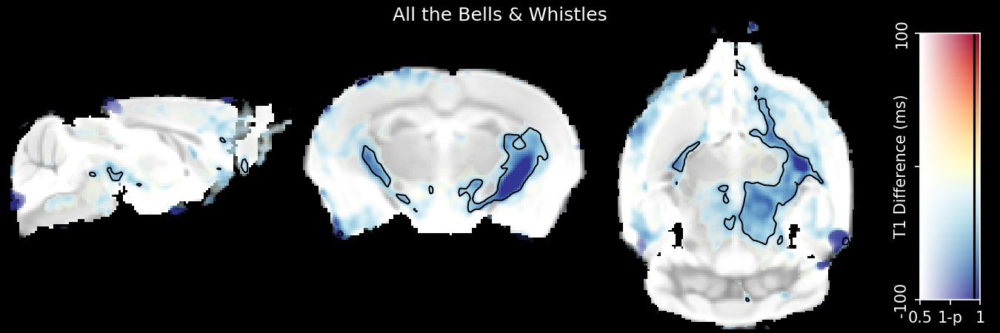
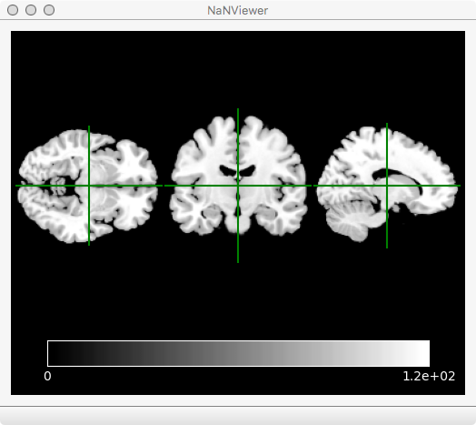

.. raw:: html

  <h1>

</h1>
  

This is a pure Python module for taking slices through MR Images and displaying
them in beautiful ways. It is friendly to both clinical and pre-clinical data,
and includes `dual-coding <http://dx.doi.org/10.1016/j.neuron.2012.05.001>`_ overlays.

`Here <https://mybinder.org/v2/gh/spinicist/nanslice/master?filepath=doc%2Fexample.ipynb>`_ is a Jupyter Notebook demonstrating the functionality.

This is an example of an image you can make with it:

And here is an example of the viewer application:

Along with the :py:mod:`~nanslice` module that can be used in your Python scripts, there are
several utitlity functions for use in :py:mod:`~nanslice.jupyter` notebooks, including a three-plane
viewer. There are also three command line tools that will installed to your $PATH:

- :py:mod:`~nanslice.nanslicer` Produces different kind of slice-plots including color bars
- :py:mod:`~nanslice.nanviewer` A three-plane viewer. Requires PyQt.
- :py:mod:`~nanslice.nanvideo` Converts time-series images to a movie file for easy viewing.

Why does :py:mod:`~nanslice` exist when there are plenty of other great MR viewing tools, e.g.
`FSLEyes <https://fsl.fmrib.ox.ac.uk/fsl/fslwiki/FSLeyes>`_ or
`MRIcroGL <http://www.cabiatl.com/mricrogl>`_? There are three reasons:

- Compatibility with pre-clinical data. Small animals (rodents) are scanned in a different orientation to humans, and hence have different definitions of superior-inferior and posterior-anterior. This makes using such images with clinically focussed tools tedious.
- Support for `dual-coding overlays <https://www.cell.com/neuron/fulltext/S0896-6273(12)00428-X>`_
- `Inner-Platform Effect <https://en.wikipedia.org/wiki/Inner-platform_effect>`_. Seen as you have to learn scripting languages if you want to have repeatable plots in other tools, you might as well build your plots with a common language straight away.

(Note: I love both MRIcroGL and FSLEyes, I use them all the time)

Okay, there's a fourth reason. I am fussy about plots. I spend a lot of time on then. Having
immediate access to all of ``matplotlib`` is a brilliant way to make beautiful plots (and also
to waste hours obessessing about your choice of fonts. Avenir Next is a hell of a drug).

.. toctree::
   :maxdepth: 4
   :caption: Contents:

   doc/modules

Indices and tables
==================

* :ref:`genindex`
* :ref:`modindex`
* :ref:`search`

Legal
=====

Copyright 2018 tobias.wood@kcl.ac.uk

This Source Code Form is subject to the terms of the Mozilla Public
License, v. 2.0. If a copy of the MPL was not distributed with this
file, You can obtain one at http://mozilla.org/MPL/2.0/.
